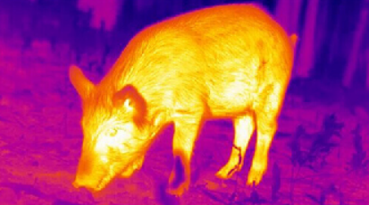
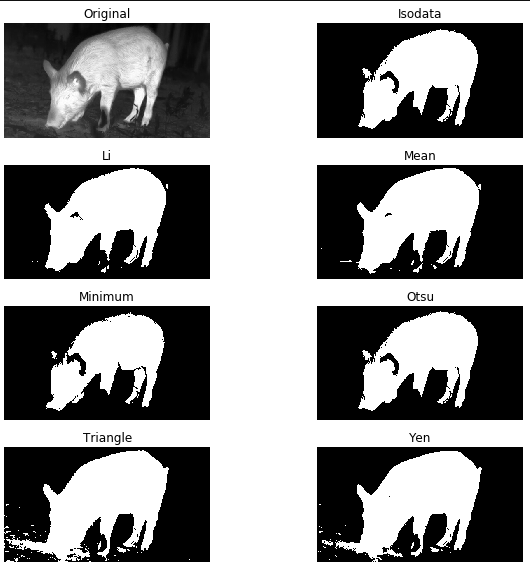
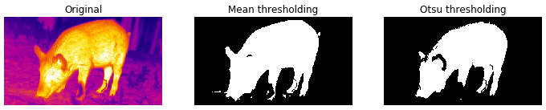

# Thermal Image Analysis #
I used this project to practice with some image analysis. I have not worked with images for a couple of years so I decided to revisit packages Python uses for image analysis. I chose to use scikit-image based on the documentation and compatability with Anaconda. 

As well as keeping up on experience, I also was practicing as I was going to need to identifiy objects in thermal images for my summer internship at Johnsonville. That is why I chose to use this thermal image of a pig:

After researching online I chose to use a few different methods. Here are the links to articles I found on these.
**Thresholding:** https://scikit-image.org/docs/stable/auto_examples/applications/plot_thresholding.html
**Canny Edge Detection:** https://datacarpentry.org/image-processing/08-edge-detection/
**Various Methods Including Watershed Transform:** https://scikit-image.org/docs/dev/user_guide/tutorial_segmentation.html

Here are the results of each method:
### Thresholding ###
This method consisted of turning the image to greyscale. Normally you would look at a histogram of the grayscale values and select a value that is the cutoff. The values on one side of the cutoff would be made white and the rest would be black essentially creating a mask. There are various functions in Scikit-Image that do this automatically so I did not select a value.

After seeing them all I selected the two best methods and compared those.

### Canny Edge Detection ###

### Watershed ###

### Comparison of Methods ###
